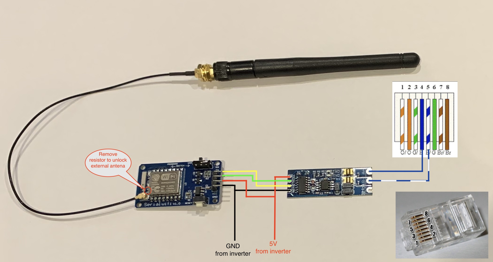
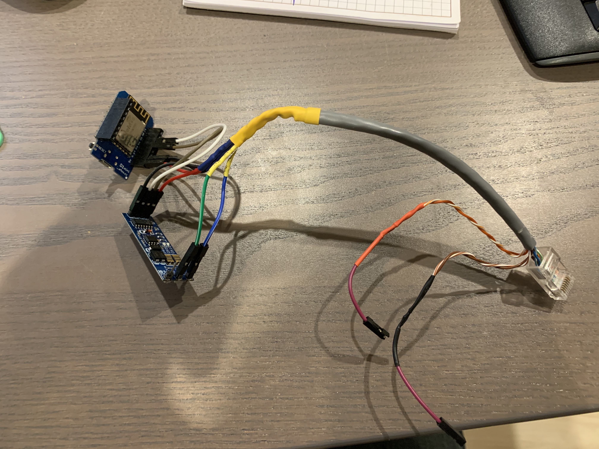
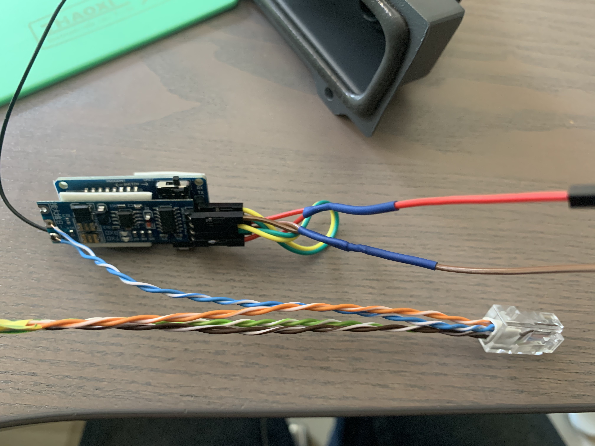
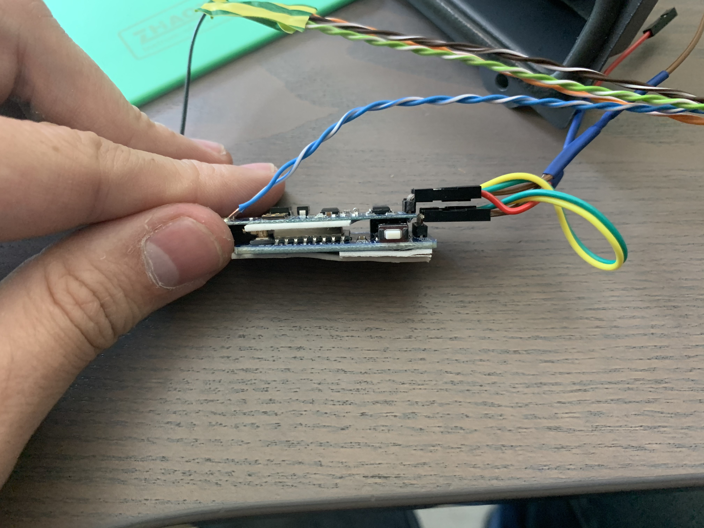
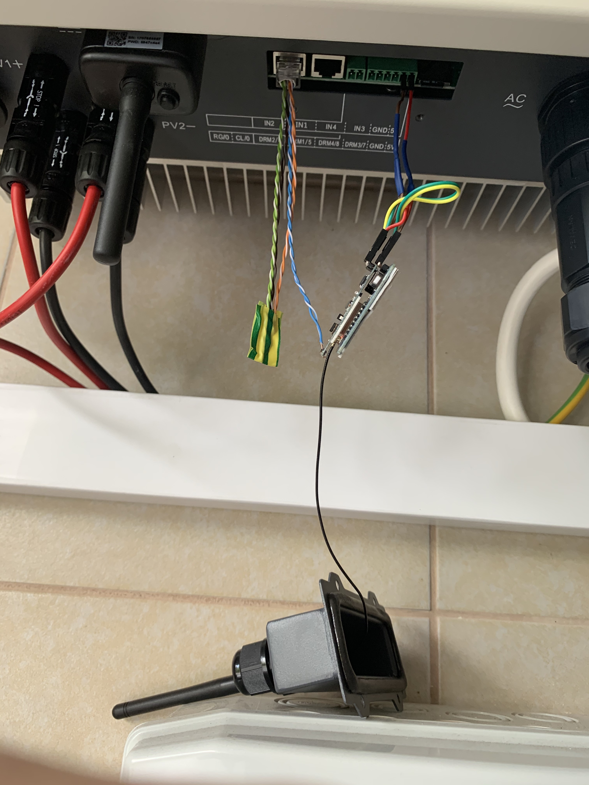
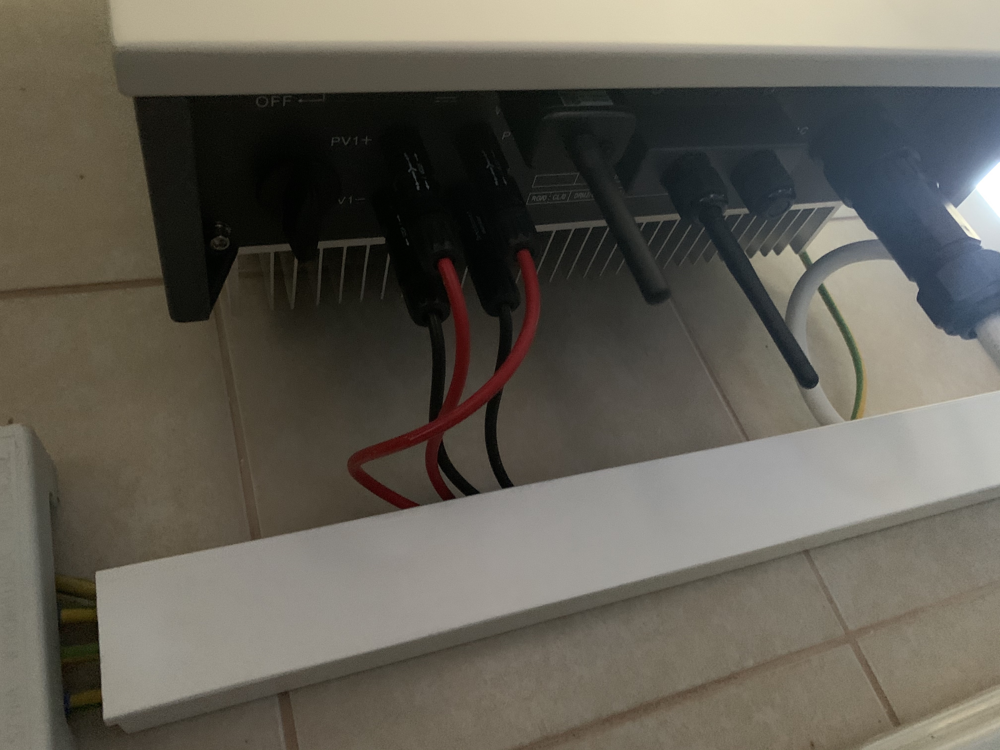

# SofarSolar ESP RS485 logger to MQTT

## Background
From the shelf logger is only works with SolarMan cloud, but I wanted to have full local integration with Home Assistant, because of poor internet connection. Additionally refresh interval from orginal logger (I managed to integrate with Home Assistant too, see HA Add-One project) is not synchronized with sensor with I have for checking energy consumption and production from/to grid. The result was funny, because power wheel shows that house produced energy. 

I asked SofarSolar for documentation of RS485 communication, but no lack. I managed to read register based on old SofarSolar documentation for other inverters models other than KTL-X (my inverter) and reversed engineered data based on information sent to SolarMan cloud. 

At the end I finished with two working loggers in parallel ;-)

## Supported inverters
For sure SofarSolar KTL-X 8.8 and other powers from KTL-X. There is a chance that other brands from the same familly with work, so if someone check please let me know.

## Parts needed to build own local logger
* "ESP-07 WiFi serial" - you will find the part under this name
* RS485 to TTL converter compatible with 3v3 (3v3 is an important, because ESP-07 operates on 3v3 TTL levels)
* External antena with connector
* RJ45 connector and cables

I bought everything from China directly. Total cost is around $5, so much cheaper than orignal logger and more freedom with integration.

## Schematic


## Image installation
Download image from *build* folder and load it to your ESP. There is a lot of tutorials how to do it on the internet ;-)

I used esptool:
```
$ esptool.py write_flash 0x0 build/esp-07.bin
```

## Connection to the inverter
Check last image. I used 5V power directly from the inverter. Red cable on photo is VCC and brown is GND. Inverter provides power only during a day, but solutions uses MQTT, so during the night there is no messages.

## Configuration
Solution uses IotWebConf library, so after uploading image and switching ESP to boot mode, you should see access point to which you can connect and configure your ESP RS485 logger.

Default IP: 192.168.4.1


After first configuration, you will need login and password to access configuration:

*Username* is admin

*Password* is set during first configuration ("AP password")


All available parameters are on screen below:


## Images
### Prototype

### Final solution





## Sample MQTT message
```
{
    "status": "normal",
    "fault_message": "",
    "dc_voltage_1": 324.1,
    "dc_current_1": 5.38,
    "dc_voltage_2": 252.3,
    "dc_current_2": 5.4,
    "ac_power": 2950,
    "ac_frequency": 49.96,
    "ac_voltage_1": 228.3,
    "ac_current_1": 4.4,
    "ac_voltage_2": 227.9,
    "ac_current_2": 4.39,
    "ac_voltage_3": 228.5,
    "ac_current_3": 4.39,
    "energy_total": 4882,
    "running_time": 2919,
    "energy_today": 2.92,
    "temperature_module": 38,
    "temperature_inverter": 49,
    "bus_voltage": 622.8,
    "vice_cpu_input_voltage_1": 323.1,
    "countdown_timer": 60,
    "pv1_insulation_resistance": 1324,
    "pv2_insulation_resistance": 2022,
    "isolation_impedance": 1635,
    "country_code?": 12,
    "phase_a_distribution": 1006,
    "phase_b_distribution": 996,
    "phase_c_distribution": 975
}
```


