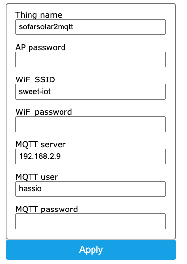

## Image installation
Download image from *build* folder and load it to your ESP. There is a lot of tutorials how to do it on the internet ;-)

I used esptool:
```
$ esptool.py write_flash 0x0 build/esp-07.bin
```

## Connection to the inverter
Check last image. I used 5V power directly from the inverter. Red cable on photo is VCC and brown is GND. Inverter provides power only during a day, but solutions uses MQTT, so during the night there is no messages.

## Configuration
Solution uses IotWebConf library, so after uploading image and switching ESP to boot mode, you should see access point to which you can connect and configure your ESP RS485 logger.

Default IP: 192.168.4.1
Default WiFi password: "sofarsolar2mqtt"

After first configuration, you will need login and password to access configuration:

*Username* is admin

*Password* is set during first configuration ("AP password")


All available parameters are on screen below:




## Sample MQTT message
```
{
    "status": "normal",
    "fault_message": "",
    "dc_voltage_1": 324.1,
    "dc_current_1": 5.38,
    "dc_voltage_2": 252.3,
    "dc_current_2": 5.4,
    "ac_power": 2950,
    "ac_frequency": 49.96,
    "ac_voltage_1": 228.3,
    "ac_current_1": 4.4,
    "ac_voltage_2": 227.9,
    "ac_current_2": 4.39,
    "ac_voltage_3": 228.5,
    "ac_current_3": 4.39,
    "energy_total": 4882,
    "running_time": 2919,
    "energy_today": 2.92,
    "temperature_module": 38,
    "temperature_inverter": 49,
    "bus_voltage": 622.8,
    "vice_cpu_input_voltage_1": 323.1,
    "countdown_timer": 60,
    "pv1_insulation_resistance": 1324,
    "pv2_insulation_resistance": 2022,
    "isolation_impedance": 1635,
    "country_code?": 12,
    "phase_a_distribution": 1006,
    "phase_b_distribution": 996,
    "phase_c_distribution": 975
}
```

## Sample Home Assistant configuration
Part of the sensors are commented, because they are too technical. 

```
sensor sofar:
  - platform: mqtt
    name: "Inverter status"
    state_topic: "inverter/status"
    value_template: "{{ value_json.status }}"
  - platform: mqtt
    name: "Inverter fault message"
    state_topic: "inverter/status"
    value_template: "{{ value_json.fault_message }}"
  - platform: mqtt
    name: "Inverter DC voltage 1"
    state_topic: "inverter/status"
    unit_of_measurement: 'V'
    value_template: "{{ value_json.dc_voltage_1 }}"
  - platform: mqtt
    name: "Inverter DC current 1"
    state_topic: "inverter/status"
    unit_of_measurement: 'A'
    value_template: "{{ value_json.dc_current_1 }}"
  - platform: mqtt
    name: "Inverter DC voltage 2"
    state_topic: "inverter/status"
    unit_of_measurement: 'V'
    value_template: "{{ value_json.dc_voltage_2 }}"
  - platform: mqtt
    name: "Inverter DC current 2"
    state_topic: "inverter/status"
    unit_of_measurement: 'A'
    value_template: "{{ value_json.dc_current_2 }}"
  - platform: mqtt
    name: "Inverter AC current power"
    state_topic: "inverter/status"
    unit_of_measurement: 'W'
    value_template: "{{ value_json.ac_power }}"
  - platform: mqtt
    name: "Inverter AC current frequency"
    state_topic: "inverter/status"
    unit_of_measurement: 'Hz'
    value_template: "{{ value_json.ac_frequency }}"
  - platform: mqtt
    name: "Inverter AC voltage 1"
    state_topic: "inverter/status"
    unit_of_measurement: 'V'
    value_template: "{{ value_json.ac_voltage_1 }}"
  - platform: mqtt
    name: "Inverter AC current 1"
    state_topic: "inverter/status"
    unit_of_measurement: 'A'
    value_template: "{{ value_json.ac_current_1 }}"
  - platform: mqtt
    name: "Inverter AC voltage 2"
    state_topic: "inverter/status"
    unit_of_measurement: 'V'
    value_template: "{{ value_json.ac_voltage_2 }}"
  - platform: mqtt
    name: "Inverter AC current 2"
    state_topic: "inverter/status"
    unit_of_measurement: 'A'
    value_template: "{{ value_json.ac_current_2 }}"
  - platform: mqtt
    name: "Inverter AC voltage 3"
    state_topic: "inverter/status"
    unit_of_measurement: 'V'
    value_template: "{{ value_json.ac_voltage_3 }}"
  - platform: mqtt
    name: "Inverter AC current 3"
    state_topic: "inverter/status"
    unit_of_measurement: 'A'
    value_template: "{{ value_json.ac_current_3 }}"
  - platform: mqtt
    name: "Inverter energy total"
    state_topic: "inverter/status"
    unit_of_measurement: 'kWh'
    value_template: "{{ value_json.energy_total }}"
  - platform: mqtt
    name: "Inverter running time"
    state_topic: "inverter/status"
    unit_of_measurement: 'h'
    value_template: "{{ value_json.running_time }}"
  - platform: mqtt
    name: "Inverter energy today"
    state_topic: "inverter/status"
    unit_of_measurement: 'kWh'
    value_template: "{{ value_json.energy_today }}"
  - platform: mqtt
    name: "Inverter module temperature"
    state_topic: "inverter/status"
    unit_of_measurement: '°C'
    value_template: "{{ value_json.temperature_module }}"
  - platform: mqtt
    name: "Inverter temperature"
    state_topic: "inverter/status"
    unit_of_measurement: '°C'
    value_template: "{{ value_json.temperature_inverter }}"

#   - platform: mqtt
#     name: "Inverter bus voltage"
#     state_topic: "inverter/status"
#     unit_of_measurement: 'V'
#     value_template: "{{ value_json.bus_voltage }}"
#   - platform: mqtt
#     name: "Inverter vice CPU input voltage 1"
#     state_topic: "inverter/status"
#     unit_of_measurement: 'V'
#     value_template: "{{ value_json.vice_cpu_input_voltage_1 }}"
#   - platform: mqtt
#     name: "Inverter countdown timer"
#     state_topic: "inverter/status"
#     unit_of_measurement: 'h'
#     value_template: "{{ value_json.countdown_timer }}"
#   - platform: mqtt
#     name: "Inverter PV1 insulation resistance"
#     state_topic: "inverter/status"
#     unit_of_measurement: 'ohm'
#     value_template: "{{ value_json.pv1_insulation_resistance }}"
#   - platform: mqtt
#     name: "Inverter PV1 insulation resistance"
#     state_topic: "inverter/status"
#     unit_of_measurement: 'ohm'
#     value_template: "{{ value_json.pv2_insulation_resistance }}"
#   - platform: mqtt
#     name: "Inverter isolation impedance"
#     state_topic: "inverter/status"
#     value_template: "{{ value_json.isolation_impedance }}"
#   - platform: mqtt
#     name: "Inverter temperature"
#     state_topic: "inverter/status"
#     value_template: "{{ value_json.country_code? }}"
#   - platform: mqtt
#     name: "Inverter phase A distribution"
#     state_topic: "inverter/status"
#     value_template: "{{ value_json.phase_a_distribution }}"
#   - platform: mqtt
#     name: "Inverter phase B distribution"
#     state_topic: "inverter/status"
#     value_template: "{{ value_json.phase_b_distribution }}"
#   - platform: mqtt
#     name: "Inverter phase C distribution"
#     state_topic: "inverter/status"
#     value_template: "{{ value_json.phase_c_distribution }}"
```

## Troubleshoot 

### No Connection to WIFI
If esp8266 cannot connect to WIFI or you entered wrong password, wait until access point will be exposed, connect to it and enter new WIFI password. You will be prompt for login and password, so enter "admin" as user and password is text which you enter to field "AP password" during first configuration.

### RS485 TXD doesn't blink with defined interval (it should blink even without connecting it to invereter )
1. Connect to esp8266 with telnet there is a debug console and logs. You need to find IP on your router. 
2. If you see only messages: "(D) Connecting to MQTT server..." it means that MQTT credencials are wrong, connect to configuration web and reconfigure.
3. If you see messages: "(D) Report status with interval: 1000" (1000 is interval in millies, this example is 1 sec) it means MQTT is configured properly, then
   1. Check if converter is properly power use multimeter 
   2. If it's powered, swap A+ and B+ cables maybe they are connected wrongly. If you use Wemos D1 mini, then use D1 and D2 pins for connection with converter.
   