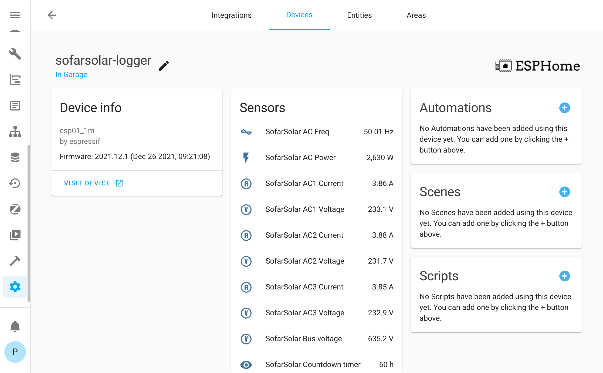

# ESPHome modbus

Here as a full config used by me to integrated with inverter. After that you see device in HA. 

Config utilize ESPHome modbus feature https://esphome.io/components/modbus.html

Any suggestion how to improve config are welcome. Potencial improvements
* [DONE] better support for fault code. Right now it's a number only
* [TODO?] all registers or only useful one?

## Config

```
substitutions:
  devicename: sofarsolar-logger
  friendly_name: SofarSolar

wifi:
  ssid: !secret wifi-ssid
  password: !secret wifi-password
  fast_connect: true

  # Enable fallback hotspot (captive portal) in case wifi connection fails
  ap:
    ssid: "sweet-fallback-${devicename}"
    password: !secret wifi-fallback-password

captive_portal:

# Enable Home Assistant API
api:
  password: !secret api-password

ota:
  password: !secret ota-password

# Enable Web server
web_server:
  port: 80

esphome:
  name: $devicename
  platform: ESP8266
  board: esp01_1m
  board_flash_mode: dout

logger:
    level: INFO
    baud_rate: 0
    
uart:
  id: mod_bus
  tx_pin: 1
  rx_pin: 3
  baud_rate: 9600
  stop_bits: 1

modbus:
  id: mod_bus_sofar

modbus_controller:
  - id: sofarsolar
    address: 0x01
    modbus_id: mod_bus_sofar
    update_interval: 10s

text_sensor:
  - platform: modbus_controller
    modbus_controller_id: sofarsolar
    name: ${friendly_name} Status
    id: inverter_status
    register_type: holding
    address: 0x0000
    response_size: 2
    lambda: |-
      auto z = "Unknown";
      char d = data[item->offset+1];
      if (d == 0) z = "Wait";
      else if (d == 1) z = "Check";
      else if (d == 2) z = "Normal";
      else if (d == 3) z = "Fault";
      else if (d == 4) z = "Permanent";
      return {z};
  - platform: modbus_controller
    modbus_controller_id: sofarsolar
    name: ${friendly_name} Fault Message
    id: inverter_fault_message
    register_type: holding
    address: 0x0001
    response_size: 10
    lambda: |-
      std::string z = "";
      int idx = item->offset;
      //byte[0]
      if ((data[idx] & 0x1) != 0) z += "GridOVP,";
      if ((data[idx] & 0x2) != 0) z += "GridUVP,";
      if ((data[idx] & 0x4) != 0) z += "GridOFP,";
      if ((data[idx] & 0x8) != 0) z += "GridUFP,";
      if ((data[idx] & 0x10) != 0) z += "PVUVP,";
      if ((data[idx] & 0x20) != 0) z += "GridLVRT,";
      if ((data[idx] & 0x40) != 0) z += "reserve-ID7,";
      if ((data[idx] & 0x80) != 0) z += "reserve-ID8,";
      //byte[1]
      idx++;
      if ((data[idx] & 0x1) != 0) z += "PVOVP,";
      if ((data[idx] & 0x2) != 0) z += "IpvUnbalance,";
      if ((data[idx] & 0x4) != 0) z += "PvConfigSetWrong,";
      if ((data[idx] & 0x8) != 0) z += "GFCIFault,";
      if ((data[idx] & 0x10) != 0) z += "PhaseSequenceFault,";
      if ((data[idx] & 0x20) != 0) z += "HwBoostOCP,";
      if ((data[idx] & 0x40) != 0) z += "HwAcOCP,";
      if ((data[idx] & 0x80) != 0) z += "AcRmsOCP,";
      //byte[2]
      idx++;
      if ((data[idx] & 0x1) != 0) z += "HwADFaultIGrid,";
      if ((data[idx] & 0x2) != 0) z += "HwADFaultDCI,";
      if ((data[idx] & 0x4) != 0) z += "HwADFaultVGrid,";
      if ((data[idx] & 0x8) != 0) z += "GFCIDeviceFault,";
      if ((data[idx] & 0x10) != 0) z += "MChip_Fault,";
      if ((data[idx] & 0x20) != 0) z += "HwAuxPowerFault,";
      if ((data[idx] & 0x40) != 0) z += "BusVoltZeroFault,";
      if ((data[idx] & 0x80) != 0) z += "IacRmsUnbalance,";
      //byte[3]
      idx++;
      if ((data[idx] & 0x1) != 0) z += "BusUVP,";
      if ((data[idx] & 0x2) != 0) z += "BusOVP,";
      if ((data[idx] & 0x4) != 0) z += "VbusUnbalance,";
      if ((data[idx] & 0x8) != 0) z += "DciOCP,";
      if ((data[idx] & 0x10) != 0) z += "SwOCPInstant,";
      if ((data[idx] & 0x20) != 0) z += "SwBOCPInstant,";
      if ((data[idx] & 0x40) != 0) z += "reserved-ID31,";
      if ((data[idx] & 0x80) != 0) z += "reserved-ID32,";
      //byte[4]
      idx++;
      if (data[idx] != 0) z += "reserved-ID33~40,";
      //byte[5]
      idx++;
      if (data[idx] != 0) z += "reserved-ID41~48,";
      //byte[6]
      idx++;
      if ((data[idx] & 0x1) != 0) z += "ConsistentFault_VGrid,";
      if ((data[idx] & 0x2) != 0) z += "ConsistentFault_FGrid,";
      if ((data[idx] & 0x4) != 0) z += "ConsistentFault_DCI,";
      if ((data[idx] & 0x8) != 0) z += "ConsistentFault_GFCI,";
      if ((data[idx] & 0x10) != 0) z += "SpiCommLose,";
      if ((data[idx] & 0x20) != 0) z += "SciCommLose,";
      if ((data[idx] & 0x40) != 0) z += "RelayTestFail,";
      if ((data[idx] & 0x80) != 0) z += "PvIsoFault,";
      //byte[7]
      idx++;
      if ((data[idx] & 0x1) != 0) z += "OverTempFault_Inv,";
      if ((data[idx] & 0x2) != 0) z += "OverTempFault_Boost,";
      if ((data[idx] & 0x4) != 0) z += "OverTempFault_Env,";
      if ((data[idx] & 0x8) != 0) z += "PEConnectFault,";
      if ((data[idx] & 0x10) != 0) z += "reserved-ID61,";
      if ((data[idx] & 0x20) != 0) z += "reserved-ID62,";
      if ((data[idx] & 0x40) != 0) z += "reserved-ID63,";
      if ((data[idx] & 0x80) != 0) z += "reserved-ID64,";
      //byte[8]
      idx++;
      if ((data[idx] & 0x1) != 0) z += "unrecoverHwAcOCP,";
      if ((data[idx] & 0x2) != 0) z += "unrecoverBusOVP,";
      if ((data[idx] & 0x4) != 0) z += "unrecoverIacRmsUnbalance,";
      if ((data[idx] & 0x8) != 0) z += "unrecoverIpvUnbalance,";
      if ((data[idx] & 0x10) != 0) z += "unrecoverVbusUnbalance,";
      if ((data[idx] & 0x20) != 0) z += "unrecoverOCPInstant,";
      if ((data[idx] & 0x40) != 0) z += "unrecoverPvConfigSetWrong,";
      if ((data[idx] & 0x80) != 0) z += "reserved-ID72,";
      //byte[9]
      idx++;
      if ((data[idx] & 0x1) != 0) z += "reserved-ID73,";
      if ((data[idx] & 0x2) != 0) z += "unrecoverIPVInstant,";
      if ((data[idx] & 0x4) != 0) z += "unrecoverWRITEEEPROM,";
      if ((data[idx] & 0x8) != 0) z += "unrecoverREADEEPROM,";
      if ((data[idx] & 0x10) != 0) z += "unrecoverRelayFail,";
      if ((data[idx] & 0x20) != 0) z += "reserved-ID78,";
      if ((data[idx] & 0x40) != 0) z += "reserved-ID79,";
      if ((data[idx] & 0x80) != 0) z += "reserved-ID80,";
      if(z.length() > 0){
        z.pop_back();
      }
      return {z};
sensor:
  - platform: wifi_signal
    id: inverter_wifi_signal
    name: ${friendly_name} WiFi Signal
    update_interval: 60s
  - platform: uptime
    id: inverter_uptime
    name: ${friendly_name} Uptime
    filters:
      - lambda: return x / 60.0;
    unit_of_measurement: minutes
  - platform: modbus_controller
    modbus_controller_id: sofarsolar
    name: ${friendly_name} DC1 Voltage
    id: inverter_dc_v1
    register_type: holding
    address: 0x0006
    unit_of_measurement: "V"
    icon: "mdi:alpha-v-circle-outline"
    value_type: U_WORD
    accuracy_decimals: 1
    filters:
      - multiply: 0.1
  - platform: modbus_controller
    modbus_controller_id: sofarsolar
    name: ${friendly_name} DC1 Current
    id: inverter_dc_c1
    register_type: holding
    address: 0x0007
    unit_of_measurement: "A"
    icon: "mdi:alpha-a-circle-outline"
    value_type: U_WORD
    accuracy_decimals: 2
    filters:
      - multiply: 0.01
  - platform: modbus_controller
    modbus_controller_id: sofarsolar
    name: ${friendly_name} DC2 Voltage
    id: inverter_dc_v2
    register_type: holding
    address: 0x0008
    unit_of_measurement: "V"
    icon: "mdi:alpha-v-circle-outline"
    value_type: U_WORD
    accuracy_decimals: 1
    filters:
      - multiply: 0.1
  - platform: modbus_controller
    modbus_controller_id: sofarsolar
    name: ${friendly_name} DC2 Current
    id: inverter_dc_c2
    register_type: holding
    address: 0x0009
    unit_of_measurement: "A"
    icon: "mdi:alpha-a-circle-outline"
    value_type: U_WORD
    accuracy_decimals: 2
    filters:
      - multiply: 0.01
  - platform: modbus_controller
    modbus_controller_id: sofarsolar
    name: ${friendly_name} DC1 Power
    id: inverter_dc_power1
    register_type: holding
    address: 0x000a
    unit_of_measurement: "W"
    device_class: "power"
    value_type: U_WORD
    filters:
      - multiply: 10
  - platform: modbus_controller
    modbus_controller_id: sofarsolar
    name: ${friendly_name} DC2 Power
    id: inverter_dc_power2
    register_type: holding
    address: 0x000b
    unit_of_measurement: "W"
    device_class: "power"
    value_type: U_WORD
    filters:
      - multiply: 10
  - platform: modbus_controller
    modbus_controller_id: sofarsolar
    name: ${friendly_name} AC Power
    id: inverter_ac_power
    register_type: holding
    address: 0x000c
    unit_of_measurement: "W"
    device_class: "power"
    value_type: U_WORD
    filters:
      - multiply: 10
  - platform: modbus_controller
    modbus_controller_id: sofarsolar
    name: ${friendly_name} AC Reactive Power
    id: inverter_ac_reactive_power
    register_type: holding
    address: 0x000d
    unit_of_measurement: "Var"
    device_class: "power"
    value_type: S_WORD
    filters:
      - multiply: 10
  - platform: modbus_controller
    modbus_controller_id: sofarsolar
    name: ${friendly_name} AC Freq
    id: inverter_ac_freq
    register_type: holding
    address: 0x000e
    unit_of_measurement: "Hz"
    icon: "mdi:current-ac"
    value_type: U_WORD
    accuracy_decimals: 2
    filters:
      - multiply: 0.01
  - platform: modbus_controller
    modbus_controller_id: sofarsolar
    name: ${friendly_name} AC1 Voltage
    id: inverter_ac_v1
    register_type: holding
    address: 0x000f
    unit_of_measurement: "V"
    icon: "mdi:alpha-v-circle-outline"
    value_type: U_WORD
    accuracy_decimals: 1
    filters:
      - multiply: 0.1
  - platform: modbus_controller
    modbus_controller_id: sofarsolar
    name: ${friendly_name} AC1 Current
    id: inverter_ac_c1
    register_type: holding
    address: 0x0010
    unit_of_measurement: "A"
    icon: "mdi:alpha-a-circle-outline"
    value_type: U_WORD
    accuracy_decimals: 2
    filters:
      - multiply: 0.01
  - platform: modbus_controller
    modbus_controller_id: sofarsolar
    name: ${friendly_name} AC2 Voltage
    id: inverter_ac_v2
    register_type: holding
    address: 0x0011
    unit_of_measurement: "V"
    icon: "mdi:alpha-v-circle-outline"
    value_type: U_WORD
    accuracy_decimals: 1
    filters:
      - multiply: 0.1
  - platform: modbus_controller
    modbus_controller_id: sofarsolar
    name: ${friendly_name} AC2 Current
    id: inverter_ac_c2
    register_type: holding
    address: 0x0012
    unit_of_measurement: "A"
    icon: "mdi:alpha-a-circle-outline"
    value_type: U_WORD
    accuracy_decimals: 2
    filters:
      - multiply: 0.01
  - platform: modbus_controller
    modbus_controller_id: sofarsolar
    name: ${friendly_name} AC3 Voltage
    id: inverter_ac_v3
    register_type: holding
    address: 0x0013
    unit_of_measurement: "V"
    icon: "mdi:alpha-v-circle-outline"
    value_type: U_WORD
    accuracy_decimals: 1
    filters:
      - multiply: 0.1
  - platform: modbus_controller
    modbus_controller_id: sofarsolar
    name: ${friendly_name} AC3 Current
    id: inverter_ac_c3
    register_type: holding
    address: 0x0014
    unit_of_measurement: "A"
    icon: "mdi:alpha-a-circle-outline"
    value_type: U_WORD
    accuracy_decimals: 2
    filters:
      - multiply: 0.01
  - platform: modbus_controller
    modbus_controller_id: sofarsolar
    name: ${friendly_name} Energy total
    id: inverter_energy_total
    register_type: holding
    address: 0x0015
    unit_of_measurement: "kWh"
    device_class: "power"
    value_type: U_DWORD
  - platform: modbus_controller
    modbus_controller_id: sofarsolar
    name: ${friendly_name} Energy generation time total
    id: inverter_energy_generation_time_total
    register_type: holding
    address: 0x0017
    unit_of_measurement: "h"
    value_type: U_DWORD
  - platform: modbus_controller
    modbus_controller_id: sofarsolar
    name: ${friendly_name} Energy today
    id: inverter_energy_today
    register_type: holding
    address: 0x0019
    unit_of_measurement: "kWh"
    device_class: "power"
    value_type: U_WORD
    accuracy_decimals: 2
    filters:
      - multiply: 0.01
  - platform: modbus_controller
    modbus_controller_id: sofarsolar
    name: ${friendly_name} Energy generation time today
    id: inverter_energy_generation_time_today
    register_type: holding
    address: 0x001A
    unit_of_measurement: "min"
    value_type: U_WORD
  - platform: modbus_controller
    modbus_controller_id: sofarsolar
    name: ${friendly_name} Temprature module
    id: inverter_temp_module
    register_type: holding
    address: 0x001B
    unit_of_measurement: "°C"
    device_class: "temperature"
    value_type: U_WORD
  - platform: modbus_controller
    modbus_controller_id: sofarsolar
    name: ${friendly_name} Temprature inverter
    id: inverter_temp_inverter
    register_type: holding
    address: 0x001C
    unit_of_measurement: "°C"
    device_class: "temperature"
    value_type: U_WORD
  - platform: modbus_controller
    modbus_controller_id: sofarsolar
    name: ${friendly_name} Bus voltage
    id: inverter_bus_voltage
    register_type: holding
    address: 0x001D
    unit_of_measurement: "V"
    icon: "mdi:alpha-v-circle-outline"
    value_type: U_WORD
    accuracy_decimals: 1
    filters:
      - multiply: 0.1
      
# Basic switch to allow you to restart the device remotely
switch:
  - platform: restart
    name: ${friendly_name} Restart

binary_sensor:
  - platform: status
    name: ${friendly_name} Status
```

## Image

