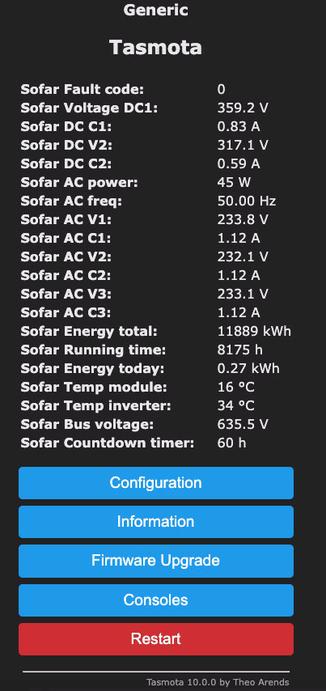

# Tasmota SMI

The script below utilize Tasmota SMI feature https://tasmota.github.io/docs/Smart-Meter-Interface/

In user_config_override.h you will find config for custom built to minimalize firmware size and be able to update it over OTA without switching to minimal image.

You need to set module Generic module (18) last on the list and afer that enable and use script below.

Script utilize pins 3 for RX and 1 for TX. It's first "3" and last "1" in line "+1,3,m,1,9600,Sofar,1,100,r010300010009,r0103000c0009,r01030015000c"

```
>D
>B
->sensor53 r
->sensor53 d0
>M 1
+1,3,m,1,9600,Sofar,1,100,r010300010009,r0103000c0009,r01030015000c

1,010312UUuux8x8@i0:1,Fault code,,fault,0
1,010312x8x2UUuux6@i0:10,DC V1,V,dc_v1 DC1,1
1,010312x8x4UUuux4@i0:100,DC C1,A,dc_c1,2
1,010312x8x6UUuux2@i0:10,DC V2,V,dc_v2,1
1,010312x8x8UUuu@i0:100,DC C2,A,dc_c2,2

1,010312UUuux8x8@i1:0.1,AC power,W,ac_power,0
1,010312x4UUuux6x6@i1:100,AC freq,Hz,ac_freq,2
1,010312x6UUuux6x4@i1:10,AC V1,V,ac_v1,1
1,010312x8UUuux6x2@i1:100,AC C1,A,ac_c1,2
1,010312x8x2UUuux6@i1:10,AC V2,V,ac_v2,1
1,010312x8x4x4UUuux4@i1:100,AC C2,A,ac_c2,2
1,010312x8x6UUuux2@i1:10,AC V3,V,ac_v3,1
1,010312x8x8UUuu@i1:100,AC C3,A,ac_c3,2

1,010318UUuuUUuux8x8x6@i2:1,Energy total,kWh,energy_total,0
1,010318x4UUuuUUuux8x8x2@i2:1,Running time,h,running_time,0
1,010318x8UUuux8x8@i2:100,Energy today,kWh,energy_today,2
1,010318x8x4UUuux8x4@i2:1,Temp module,°C,temp_module,0
1,010318x8x6UUuux8x2@i2:1,Temp inverter,°C,temp_inverter,0
1,010318x8x8UUuux8@i2:10,Bus voltage,V,bus_voltage,1
1,010318x8x8x6UUuux2@i2:1,Countdown timer,h,countdown_timer,0

#
```

## Extra configuration
I've notice that during inverter startup or shotdown logger is power few times in a row (blinking display). This cause reset config cycle for Tasmota to prevent that set 
```
SetOption65 1  
```

## Known issues
SMI script doesn't integrate ideally with HA. I created an request to hatasmota library used to integrate with HA: https://github.com/emontnemery/hatasmota/issues/130 and that was a trigger to check ESPHome integration. Tasmota it's still usable and it's possible to configure with HA, but you need to add extra configs 

## Image
